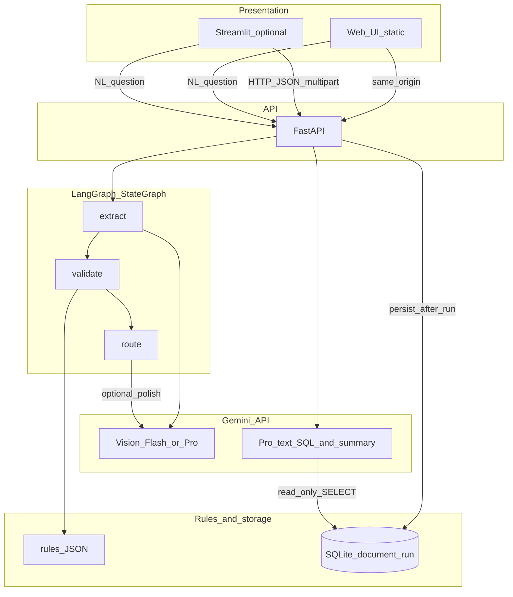

# Multi-agent trade document validation

A reference implementation of a **three-stage** pipeline for trade paperwork: **multimodal extraction** (PDF or image) with per-field confidence, **rule-based validation** against a customer profile, and a **routing** step that proposes the next action (including optional draft supplier communication). Orchestration uses **LangGraph**; the default LLM stack is **Google Gemini 2.5** (Flash / Pro). **FastAPI** runs the pipeline, serves **OpenAPI** docs, and hosts a **static web UI** (`frontend/`: HTML, CSS, JS) on the same origin. A **Streamlit** app remains available as an alternative client. Natural-language analytics hit the same API as the browser UI.

## Features

- **Extractor** — Structured output for eight core trade fields (consignee, HS code, ports, Incoterms, goods description, gross weight, invoice number) with **confidence** and **source snippets**.
- **Validator** — Per-field `match` / `mismatch` / `uncertain` against a JSON rule pack ([`acme_retail_eu`](src/trade_validator/rules/acme_retail_eu.json)); uncertain fields are never auto-approved.
- **Router** — `auto_approve`, `human_review`, or `draft_amendment_request` with reasoning and a structured discrepancy list.
- **Persistence** — SQLite (`SQLModel`) for run history; configurable URL for portability to Postgres-style deployments.
- **NL analytics** — Plain-English questions translated to **read-only** `SELECT` statements, with answers grounded in query results.

## Part 1 deliverables (checklist)

| Deliverable | Where |
|-------------|--------|
| Three agents (extract / validate / route) + Pydantic contracts | `src/trade_validator/agents/`, `schemas/` |
| LangGraph orchestration + `MemorySaver` checkpoints | `src/trade_validator/graph/pipeline.py` |
| Acme customer rules (JSON) | `src/trade_validator/rules/acme_retail_eu.json` |
| Gemini 2.5 Flash (default) / Pro (optional + NL path) | `clients/gemini_client.py`, `agents/extractor.py`, `services/nl_query.py` |
| SQLite persistence + NL → read-only SQL | `db/`, `services/storage.py`, `services/nl_query.py` |
| FastAPI (`/api/v1/pipeline/run`, `/api/v1/query`, `/health`) | `src/trade_validator/api/` |
| Operator UI | `frontend/` (primary, served at `/`) and optional `streamlit_app/` |
| Runnable samples + generator | `samples/`, `scripts/generate_acme_sample_invoice.py` |
| Product + technical docs | `docs/PRD.md`, `docs/TECH_WRITEUP.md`, `docs/SAMPLE_QUERIES.md` |
| Automated tests | `tests/` — run `python -m pytest` with the same env as `pip install -e ".[dev]"` |
| License | `LICENSE` (MIT) |

**Submission artifacts:** Export `docs/PRD.md` and `docs/TECH_WRITEUP.md` to PDF as described in those files; screen demo using the web UI or Streamlit per `docs/SAMPLE_QUERIES.md`.

## Architecture

Data flows **in one direction** through LangGraph: **extract → validate → route**. The UI only talks to **FastAPI**; the API runs the graph, persists to SQLite, and serves the NL query endpoint. **Gemini** is used for vision extraction (and optionally amendment-email polish), and for NL→SQL + grounded summarization.



**State:** Each node reads/writes a typed `GraphState` (extraction, validation, and router payloads as JSON-serializable dicts from Pydantic). **Checkpoints:** `MemorySaver` + per-run `thread_id` for resumability in development.

## Repository structure

```text
Multi-Agent-Trade-Validator/
├── docs/                          # PRD, technical notes, sample NL queries
├── samples/                       # Example invoice PNGs + README
├── scripts/                       # e.g. generate_acme_sample_invoice.py
├── frontend/                      # Static UI (served by FastAPI at /)
├── src/trade_validator/
│   ├── agents/                    # extractor, validator, router
│   ├── api/                       # FastAPI app + routes (pipeline, query)
│   ├── clients/                   # Gemini client helpers
│   ├── config.py                  # env-driven limits and defaults
│   ├── db/                        # SQLModel models + engine/session
│   ├── graph/                     # LangGraph pipeline + state
│   ├── rules/                     # Bundled customer JSON (e.g. acme_retail_eu)
│   ├── schemas/                   # Pydantic I/O contracts
│   └── services/                  # rules_loader, storage, nl_query, textnorm
├── streamlit_app/
│   └── app.py                     # UI (HTTP client to API only)
├── tests/
├── .env.example
├── LICENSE
├── pyproject.toml
└── README.md
```

## Requirements

- Python **3.11+**
- [Gemini API key](https://aistudio.google.com/apikey) (`GEMINI_API_KEY` or `GOOGLE_API_KEY`)

## Quick start

```bash
git clone https://github.com/reethj-07/Multi-Agent-Trade-Validator.git
cd Multi-Agent-Trade-Validator
python -m venv .venv
source .venv/bin/activate          # Linux / macOS
# .venv\Scripts\activate           # Windows
pip install -e ".[dev]"
cp .env.example .env                 # set GEMINI_API_KEY
```

**API + web UI** (one process):

```bash
python -m uvicorn trade_validator.api.main:app --host 127.0.0.1 --port 8000
```

Open **http://127.0.0.1:8000/** in a browser for the main UI (pipeline upload, per-field table, router, NL analytics). **http://127.0.0.1:8000/docs** for OpenAPI.

If the app is run from an installed package without the `frontend/` folder next to the project tree, set `TRADE_VALIDATOR_FRONTEND_DIR` to an absolute path to your `frontend` directory.

**Streamlit** (optional second terminal, same API):

```bash
export TRADE_VALIDATOR_API_URL=http://127.0.0.1:8000   # Linux / macOS
# set TRADE_VALIDATOR_API_URL=http://127.0.0.1:8000    # Windows CMD
python -m streamlit run streamlit_app/app.py
```

**Tests:**

```bash
python -m pytest
```

Use the **same** Python interpreter you used for `pip install -e ".[dev]"` so imports and `google-genai` resolve correctly.

**Health:** `GET /health`

## API

| Method | Path | Description |
|--------|------|-------------|
| `POST` | `/api/v1/pipeline/run` | Multipart `file`; query params `customer_id`, `use_pro_extraction` |
| `POST` | `/api/v1/query` | JSON body `{"question": "..."}` |
| `GET` | `/health` | Liveness |

## Configuration

| Variable | Default | Purpose |
|----------|---------|---------|
| `GEMINI_API_KEY` / `GOOGLE_API_KEY` | — | Gemini Developer API |
| `TRADE_VALIDATOR_DATABASE_URL` | `sqlite:///./trade_validator.db` | Database URL |
| `TRADE_VALIDATOR_API_URL` | — | Streamlit → API base URL |
| `TRADE_VALIDATOR_MAX_LLM_CALLS` | `8` | Max LLM round-trips per pipeline run |
| `TRADE_VALIDATOR_EXTRACTION_UNCERTAIN_THRESHOLD` | `0.35` | Extraction confidence below → validator `uncertain` |
| `TRADE_VALIDATOR_FRONTEND_DIR` | — | Absolute path to static UI if auto-discovery fails |

## Package map

| Path | Role |
|------|------|
| `src/trade_validator/schemas/` | Pydantic contracts between stages |
| `src/trade_validator/agents/` | Extractor, validator, router |
| `src/trade_validator/graph/` | LangGraph `StateGraph`, checkpoints |
| `src/trade_validator/db/` | SQLModel models and session |
| `src/trade_validator/services/` | Rules, storage, NL query |
| `src/trade_validator/api/` | FastAPI application |
| `frontend/` | Static web UI (HTML/CSS/JS; mounted at `/` by FastAPI) |
| `streamlit_app/` | Optional Streamlit UI (HTTP client only) |
| `samples/` | Example inputs and generator script |
| `tests/` | Pytest suite |
| `docs/` | Product and technical documentation |

## Documentation

| Document | Contents |
|----------|----------|
| [docs/PRD.md](docs/PRD.md) | Product context, personas, architecture rationale, metrics |
| [docs/TECH_WRITEUP.md](docs/TECH_WRITEUP.md) | System diagram, failure handling, cost/latency, operations |
| [docs/SAMPLE_QUERIES.md](docs/SAMPLE_QUERIES.md) | Example NL questions over `document_run` |

## Development notes

- Use the **same** Python environment for `pip install -e .` and `python -m uvicorn` (avoid mixing system `uvicorn` with a different interpreter).
- After code changes, **restart** the API process so imports reload.
- Sample PNGs can be regenerated: `python scripts/generate_acme_sample_invoice.py`.

## License

See [LICENSE](LICENSE).
