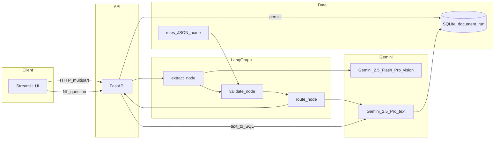

# Technical write-up — Part 1

**Purpose:** Companion to the runnable POC—architecture, failures, ops thinking. **Export to PDF (1–2 pages)** or paste into Google Docs for submission.

---

## 1 | Architecture (diagram)

**Data flow:** Upload → FastAPI writes temp file → LangGraph `GraphState` carries `document_path`, `customer_id`, `llm_calls`, `errors`. Nodes emit Pydantic `model_dump(mode="json")`; next node `model_validate`s. **State at rest:** SQLite `document_run` row per completed run; **LangGraph** `MemorySaver` checkpoints in-process (UUID `thread_id`).

---

## 2 | Three nasty failure modes (from real testing, not hypotheticals)

**1) “Correct extraction, wrong validator” (port city + country)**  
**Symptom:** Model returned `Shanghai, China` and `Rotterdam, Netherlands`; allowlist contained `SHANGHAI`, `ROTTERDAM`. Normalized string `SHANGHAI, CHINA` failed **exact** set membership → **false mismatch** → **`draft_amendment_request`**.  
**Fix:** `primary_port_city()`—take the segment **before** the first comma (after Unicode comma normalization). **Retest:** degraded Acme PNG → ports **match**, **`auto_approve`**.

**2) Environment split (API won’t import package)**  
**Symptom:** `ModuleNotFoundError: No module named 'trade_validator'` when running `uvicorn.exe` from Anaconda while `pip install -e` targeted another Python user-site.  
**Fix:** **`python -m uvicorn`** with the **same** interpreter as `pip`; README + verification checklist.

**3) Streamlit widget session KeyError**  
**Symptom:** `st.session_state has no key "$$WIDGET_ID-…"` on `st.text_area` in sidebar (Streamlit 1.46+).  
**Fix:** explicit **`key=`** on every widget; retest full UI flow.

**Secondary (designed-for):** vision **hard failure** → extract node **fallback empty extraction** + traceback in `errors[]` → downstream **uncertain** / **human_review**—tested via code path in `graph/pipeline.py`.

---

## 3 | Observability at scale (50 customers)

**Trace one shipment:** **`job_id`** == LangGraph **`thread_id`** (UUID) returned in API JSON and stored in **`document_run.id`**. Log **structured fields**: `job_id`, `customer_id`, node name, `llm_calls` after each LLM hop, `final_action`, duration per node.

**Dashboard (sketch):** requests/min; **p50/p95** latency for extract / validate / route / persist; **% uncertain** and **% auto_approve**; **LLM $/1k docs**; **error rate** (extract exception, NL SQL guard rejections); **top customer_id** by volume.

---

## 4 | Cost (back-of-envelope)

**Dominant:** **multimodal extraction**—image/PDF input tokens + JSON output (Flash default; Pro on retry). **Secondary:** NL query (**2** Pro calls: generate `SELECT` + summarize rows) **only when invoked**. **Amendment polish:** optional Flash call, skipped when `llm_calls` ≥ cap.

**Control:** Flash-first; **single Pro retry** on extract exception; **`TRADE_VALIDATOR_MAX_LLM_CALLS`**; template email without polish when budget exhausted.

---

## 5 | Latency

**Slowest hop:** **vision extraction** (large PDF/image, single round-trip). **Improvements:** page **cropping** / tiling for giant PDFs; **async** queue + worker pool; **cache** by content hash; pre-render **downscaled** images when legibility allows.

---

## 6 | If I had a week instead of a day

- **Golden eval CI** (20+ labeled docs) with **regression thresholds**.  
- **`GET /runs` + run detail** for support.  
- **Stricter NL-SQL** allowlist (table/column only, read-only DB role).  
- **Multi-page** table extraction strategy (section prompts or layout model).

---

## Appendix — Repo entrypoints

| Surface | Command / path |
|---------|------------------|
| API | `python -m uvicorn trade_validator.api.main:app --host 127.0.0.1 --port 8000` |
| UI | `python -m streamlit run streamlit_app/app.py` |
| Tests | `pytest` |
