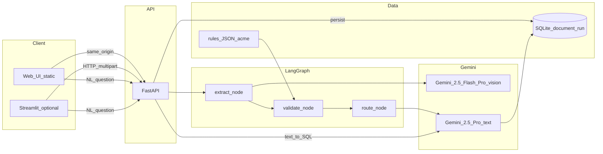

# Technical write-up — Part 1

This is the informal companion to the repo: how the pieces connect, what went wrong while I wired them, and what I’d watch if this ever left my laptop. If someone asks for a PDF, you can export this (about a page or two) or paste it into Docs.

---

## 1 | Architecture

**In plain English:** the browser (or Streamlit) talks only to FastAPI. An upload lands as multipart; we write bytes to a temp file so Gemini can read the same thing the user sent. LangGraph’s state carries the path, customer id, how many LLM calls we’ve burned, and any errors worth surfacing. Each node writes Pydantic-shaped JSON into that dict; the next node parses it back in—no “trust me” strings in between. When the graph finishes, we persist one row in SQLite (`document_run`). Checkpoints use LangGraph’s `MemorySaver`, keyed by the same UUID we use as `job_id`, which is handy for reasoning about replay in dev even though each HTTP request today runs a fresh graph to completion.

---

## 2 | Three bugs that weren’t in the spec

**Ports that looked wrong when they weren’t.**  
The model happily returned `Shanghai, China` and `Rotterdam, Netherlands`. Our allowlist was just city tokens like `SHANGHAI` and `ROTTERDAM`. After normalization we were comparing `SHANGHAI, CHINA` to a set of bare names—so we flagged a mismatch and drafted an amendment for ports that were actually fine. The fix wasn’t glamorous: strip to the token before the first comma (including the weird Unicode comma variants), then compare. Re-ran on the degraded Acme sample; ports matched; router moved to auto-approve. That kind of mismatch is exactly why I wanted the validator in code, not buried in a prompt.

**Two Pythons on one machine.**  
Classic Windows footgun: `uvicorn.exe` on PATH pointed at one environment, `pip install -e .` went somewhere else, and I got `ModuleNotFoundError: trade_validator`. The fix is boring and effective: always `python -m uvicorn …` with the interpreter you actually installed into. That’s spelled out in the README so the next person doesn’t lose an afternoon.

**Streamlit and widget keys.**  
A newer Streamlit version started complaining about `st.text_area` unless every widget had an explicit `key=`. One pass through `streamlit_app/app.py` fixed it; still annoying.

There’s also a deliberate unhappy path: if vision blows up completely, we fall back to an empty extraction, stash the traceback in `errors[]`, the validator leans uncertain, and the router sends **human_review**. That’s wired in `graph/pipeline.py`—it won’t show up in a polished demo unless you break something on purpose.

---

## 3 | Observability (if this had fifty customers)

For a single shipment you can line up three ids without guessing: `job_id` from the API response, `thread_id` in LangGraph config, and `document_run.id` in SQLite—they’re the same UUID.

If I were adding logging tomorrow, I’d emit one structured line per hop: those ids, customer, node name, `llm_calls` after the step, `final_action` at the end, wall time per node.

A dashboard I’d actually open: requests per minute, p50/p95 for extract / validate / route / persist, share of runs that hit uncertain vs auto-approve, rough LLM cost per thousand documents, error rate (vision failures, NL SQL rejected by the guard), and which `customer_id` is eating the budget.

---

## 4 | Cost (back-of-envelope)

Almost all the money is multimodal extraction—big PDF or image in, JSON schema out. Flash by default; Pro once if Flash throws. A natural-language analytics question costs two Pro text calls when someone runs it (generate SQL, then summarize the rows). Amendment polish is usually a small Flash pass; if we’ve already hit the LLM cap for the run, we skip polish and keep the template body.

---

## 5 | Latency

Vision dominates the clock; validate and route are cheap by comparison. If this had to scale next week, I’d look at cropping or tiling huge PDFs, pushing work to a queue instead of blocking the API thread, caching by file hash, and downscaling images when the text is still readable.

---

## 6 | If I had a week instead of a day

Golden-set tests in CI with a floor on extraction F1. A `GET /runs` plus a detail view for support. Tighter NL-SQL (allowlisted tables/columns, read-only DB role at the database level, not just string guards). A real strategy for dense multi-page tables instead of one giant vision call.

---

## Appendix — How to run it

| What | Command / URL |
|------|----------------|
| API + main UI | `python -m uvicorn trade_validator.api.main:app --host 127.0.0.1 --port 8000` then open `http://127.0.0.1:8000/` |
| Streamlit (optional) | `python -m streamlit run streamlit_app/app.py` — set `TRADE_VALIDATOR_API_URL` if the API isn’t local |
| Tests | `python -m pytest` with the **same** Python you used for `pip install -e ".[dev]"` |
