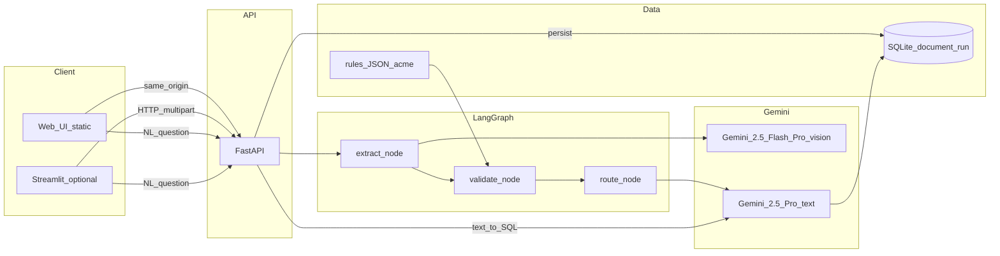

# Technical write-up — Part 1

**Purpose:** Short companion to the repo—how it’s wired, what broke while building it, what I’d watch in prod. Export to PDF (1–2 pages) or paste into Docs for submission if they want a separate artifact.

---

## 1 | Architecture (diagram)

Flow in plain terms: upload hits FastAPI, we spill bytes to a temp file, LangGraph’s state carries path, customer id, llm call budget, and any errors. Each node dumps Pydantic JSON into that dict and the next node parses it back in. When the run finishes we persist one row in SQLite (`document_run`). Checkpoints are in-memory (`MemorySaver`) keyed by the same UUID we use as `job_id` so you can at least reason about replay in dev.

---

## 2 | Three failure modes that actually bit me

**1) Good extraction, bad validator (ports with “city, country”)**  
The model returned `Shanghai, China` and `Rotterdam, Netherlands`. The allowlist was `SHANGHAI`, `ROTTERDAM`. After uppercasing we compared `SHANGHAI, CHINA` to a set of bare city tokens—so we flagged a mismatch and routed to amendment even though the ports were right. Fix was boring: strip to the token before the first comma (including Unicode comma variants), then compare. Re-ran on the degraded Acme PNG and ports matched; router went to auto-approve.

**2) Two Pythons**  
`ModuleNotFoundError: trade_validator` because `uvicorn.exe` on PATH pointed at Anaconda while `pip install -e .` landed in a different site-packages. The fix is always `python -m uvicorn …` with the interpreter you actually installed into; we called that out in the README so the next person doesn’t burn an hour on it.

**3) Streamlit sidebar text area**  
Newer Streamlit blew up with a session key error on `st.text_area` unless every widget had an explicit `key=`. Annoying but one pass through the file fixed it.

There’s also a deliberate path when vision hard-fails: empty extraction, traceback in `errors[]`, validator marks uncertainty, router pushes human review. That’s exercised from `graph/pipeline.py` rather than a happy-path demo.

---

## 3 | Observability (sketch for “50 customers”)

For one shipment you can line up `job_id` from the API with `thread_id` in LangGraph and `document_run.id` in SQLite—it’s the same UUID. If I were logging for real I’d emit one line per hop: ids, customer, node name, `llm_calls` after the call, `final_action` when you’re done, and wall time per node.

A dashboard I’d actually look at: requests per minute, p50/p95 for extract/validate/route/persist, share of runs that hit uncertain vs auto-approve, rough LLM cost per thousand docs, error rate (vision blowups, NL SQL rejected by the guard), and which `customer_id` is eating the budget.

---

## 4 | Cost (rough)

Almost all the money is multimodal extraction—big image/PDF in, JSON schema out. Flash by default, Pro once if Flash throws. NL questions cost two Pro text calls when someone runs them (generate SQL, then summarize rows). Amendment polish is a cheap Flash pass unless you’re already at the LLM cap, in which case we fall back to the template body.

---

## 5 | Latency

Vision extraction dominates; everything else is cheap in comparison. If this had to scale tomorrow I’d look at cropping or tiling huge PDFs, a worker queue instead of blocking the API thread, caching by file hash, and downscaling images when the text is still readable.

---

## 6 | If I had a week instead of a day

Golden-set tests in CI with a floor on extraction F1. A `GET /runs` plus detail view for support. Tighter NL-SQL (allowlisted tables/columns, read-only DB role). A real plan for multi-page tables instead of one big vision call.

---

## Appendix — Repo entrypoints

| Surface | Command / path |
|---------|------------------|
| API + primary UI | `python -m uvicorn trade_validator.api.main:app --host 127.0.0.1 --port 8000` then open `http://127.0.0.1:8000/` |
| Streamlit (optional) | `python -m streamlit run streamlit_app/app.py` (set `TRADE_VALIDATOR_API_URL`) |
| Tests | `python -m pytest` (use the same interpreter as `pip install -e ".[dev]"`) |
